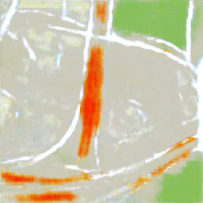

# Pix2Pix Image Translation


This project implements the Pix2Pix Generative Adversarial Network (GAN) for image-to-image translation tasks. It is designed to work with custom datasets, enabling the transformation of input images into desired output formats. This README outlines the setup and usage of the project for training and testing models on various datasets.

## Features

- **Custom Dataset Training:** Train Pix2Pix models using datasets tailored to specific needs.
- **Image Translation Generation:** Generate translated images from trained models.
- **Data Normalization:** Prepare input data through normalization for improved model performance.
- **Configurable Training Parameters:** Customize epochs, learning rate, and lambda values for optimal training results.
- **Multi-device Support:** Run models on CPU, GPU, and Apple Silicon (MPS) to leverage different hardware capabilities.
- **Interactive Sample Generation:** Generate and display output samples during the testing phase for immediate feedback.

## Demo - During training



## Full Command Options

A comprehensive list of options for configuring the training and testing of the Pix2Pix model:

- **`--dataset <path>`**: Path to the dataset zip file.
- **`--normalized <True|False>`**: Specify if images should be normalized (default: True).
- **`--epochs <number>`**: Number of training epochs (default: 20).
- **`--lr <value>`**: Learning rate for the optimizer (default: 0.0002).
- **`--beta1 <value>`**: Beta1 hyperparameter for the Adam optimizer (default: 0.5).
- **`--lambda_value <value>`**: Lambda value for loss calculation (default: 100).
- **`--device <cuda|cpu|mps>`**: Device for running the model ('cuda', 'cpu', 'mps'; default: 'mps').
- **`--display <True|False>`**: Display output during training/testing (default: True).
- **`--samples <number>`**: Number of samples for plotting during testing (default: 20).
- **`--train`**: Flag to initiate training mode.
- **`--test`**: Flag to initiate testing mode.

## Installation

To set up the Pix2Pix project for image translation, clone the repository and install the required dependencies:

```bash
git clone https://github.com/your/pix2pix-repository.git
cd pix2pix-directory
pip install -r requirements.txt
```

## Training Command Comparison

The table below compares the commands for training the Pix2Pix model across different devices, illustrating how to adapt the training process to CPU, GPU, and MPS environments.

| Device Type         | Command                                                                                                                                         |
| ------------------- | ----------------------------------------------------------------------------------------------------------------------------------------------- |
| CPU                 | `python main.py --train --dataset path/to/your/dataset.zip --epochs 20 --lr 0.0002 --beta1 0.5 --lambda_value 100 --device cpu --display True`  |
| GPU                 | `python main.py --train --dataset path/to/your/dataset.zip --epochs 20 --lr 0.0002 --beta1 0.5 --lambda_value 100 --device cuda --display True` |
| Apple Silicon (MPS) | `python main.py --train --dataset path/to/your/dataset.zip --epochs 20 --lr 0.0002 --beta1 0.5 --lambda_value 100 --device mps --display True`  |

## Testing Command

```bash
python main.py --test --samples 20 --device [device_type]
```

Adjust the `--device` option based on the hardware (CPU, GPU, or MPS) to leverage specific computational resources.

## Training and Generating Images - Importing the Modules

### Using CUDA

To leverage CUDA for accelerated computing, follow the instructions below. This setup is ideal for training and testing models with NVIDIA GPUs, ensuring fast processing and efficient handling of large datasets.

**Prerequisites:**

- Ensure CUDA-compatible hardware is available and properly configured.
- Verify that the necessary CUDA drivers and libraries are installed on your system.

**Script Execution:**

1. **Data Preparation:**

   - Initialize and configure the data loader for image preprocessing and dataset creation.

   ```python
   from src.dataloader import Loader

   loader = Loader(dataset="path/.zip", normalized=True)
   loader.unzip_folder()
   dataloader = loader.create_dataloader()

   ```

2. **Model Training:**

   - Set up and initiate the training process using specified parameters.

   ```python
   from src.trainer import Trainer

   trainer = Trainer(epochs=100,lr=0.0002, beta1=0.5, lambda_value=100, device="cuda", display=True,)
   trainer.train(activate = True)
   ```

3. **Model Testing:**

   - Execute model testing to evaluate performance and generate synthetic images.

   ```python
   from src.test import Test

   test = Test(samples=20, device="cuda")
   test.test()
   ```

### Using MPS

For leveraging MPS on Apple's hardware for efficient computing, follow these steps. This approach is optimized for macOS devices equipped with Apple Silicon or other compatible GPUs.

**Prerequisites:**

- Ensure your macOS device supports MPS and is equipped with compatible hardware.
- Confirm that your environment is set up to utilize MPS for PyTorch or other machine learning frameworks.

**Script Execution:**

The steps are similar to those for CUDA, with the device parameter set to `"mps"` in all relevant instances. This ensures that MPS is utilized for all computational tasks.

### Using CPU

To execute the training and generation processes on a CPU, follow the outlined steps. This setup is universally applicable but may lead to longer processing times compared to CUDA or MPS.

**Prerequisites:**

- No specific hardware requirements other than a functional CPU.
- Ensure your Python environment is correctly set up with all required libraries installed.

**Script Execution:**

The procedure remains consistent with the CUDA and MPS sections, with the device parameter adjusted to `"cpu"`. This configuration directs all computations to be processed by the CPU.

## Documentation

For detailed documentation on the implementation and usage, visit the -> [AC-GAN Documentation](https://atikul-islam-sajib.github.io/AC-GAN-deploy/).

## Contributing

Contributions to improve the project are welcome. Please follow the standard procedures for contributing to open-source projects.

## License

This project is licensed under [MIT LICENSE](./LICENSE). Please see the LICENSE file for more details.

## Acknowledgements

Thanks to all contributors and users of the LSGAN project. Special thanks to those who have provided feedback and suggestions for improvements.

## Contact

For any inquiries or suggestions, feel free to reach out to [atikulislamsajib137@gmail.com].

## Additional Information

- This project is a work in progress and subject to changes.
- Feedback and suggestions are highly appreciated.
- Courtesy: Atikul Islam Sajib
